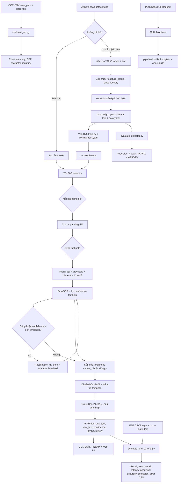

# Vietnamese License Plate Recognition

[](https://github.com/haminhthong/vietnamese-license-plate-recognition/actions/workflows/ci.yml)
[](https://www.python.org/)
[](https://github.com/ultralytics/ultralytics)
[](https://github.com/JaidedAI/EasyOCR)
[](https://fastapi.tiangolo.com/)
[](https://www.docker.com/)
[](LICENSE)

Pipeline nhận diện biển số xe Việt Nam từ ảnh tĩnh, gồm YOLOv8 để phát hiện vùng biển số, EasyOCR để đọc ký tự và bộ kiểm tra cú pháp để đánh dấu kết quả cần xem xét. Mã nguồn, cấu hình, báo cáo đánh giá và CI dùng chung một luồng kỹ thuật được mô tả dưới đây.

## Bài toán và phạm vi ứng dụng

### Bài toán

Với một ảnh xe đầu vào, hệ thống cần:

1. Phát hiện tất cả vùng biển số bằng YOLOv8.
2. Cắt vùng biển số có thêm lề 5% và xử lý ảnh để OCR ổn định hơn.
3. Đọc ký tự bằng EasyOCR, sắp xếp token theo bố cục 1 dòng hoặc 2 dòng.
4. Chuẩn hóa chuỗi, kiểm tra mẫu định dạng biển số dân sự Việt Nam và trả về gợi ý sửa lỗi OCR nếu có.
5. Giữ lại cả chuỗi đọc được và gợi ý sửa để người vận hành có thể kiểm tra, không tự động ghi đè kết quả thô.

### Phạm vi

- Đầu vào chính là ảnh JPEG, PNG hoặc WebP; API giới hạn tệp tải lên tối đa 10 MB.
- Hỗ trợ ảnh có biển dài 1 dòng và biển 2 dòng dựa trên tỷ lệ khung hình cùng hình học token OCR.
- Bộ mẫu hiện tại hỗ trợ chuỗi dân sự dài 7 đến 10 ký tự theo `resources/plate_templates.yaml`.
- Không bao gồm theo dõi đối tượng trong video, nhận dạng biển ngoại giao, biển quân đội, đọc ảnh trực tiếp từ camera hoặc cơ chế tự động xác nhận pháp lý.
- Dữ liệu ảnh thực tế, trọng số `.pt` và dataset cục bộ không được commit vào repository.

## Luồng logic, luồng dữ liệu và quy trình kỹ thuật



### Chi tiết logic suy luận

1. `LicensePlateRecognizer.predict()` kiểm tra ảnh không rỗng, kích thước tối thiểu `160x120` và ngưỡng detector trong `[0, 1]`.
2. YOLOv8 chạy với `conf=detection_confidence`, `iou=nms_iou` và `imgsz=image_size`.
3. Mỗi box được cắt trong biên ảnh, thêm `padding_ratio`; crop quá nhỏ bị bỏ qua.
4. `read_plate()` chạy CLAHE trước. Khi chuỗi rỗng hoặc confidence thấp hơn `ocr_threshold`, hệ thống thử rectification và adaptive threshold nếu được bật.
5. Token OCR được chuẩn hóa về chữ Latin in hoa và chữ số, lọc theo `ocr_minimum_confidence`, loại token thấp bất thường rồi sắp xếp theo bố cục.
6. `validate_and_correct_plate()` chỉ tạo `suggested_text`; trường `text` vẫn là chuỗi đã chuẩn hóa từ OCR. `needs_review=true` khi sai format, confidence OCR thấp, confidence detector thấp hơn ngưỡng tự động chấp nhận hoặc có gợi ý sửa.
7. CLI in danh sách JSON và có thể ghi ảnh minh họa. API chạy suy luận trong thread riêng, trả mã lỗi rõ ràng cho loại tệp, tệp rỗng, ảnh lỗi, model thiếu hoặc lỗi suy luận.

### Cấu hình đang được dùng

`configs/recognition.yaml` được dùng chung bởi CLI, API và hai evaluator:

| Nhóm | Khóa | Giá trị hiện tại |
|---|---|---:|
| Detector | `detection_confidence` | `0.25` |
| Detector | `auto_accept_detector_threshold` | `0.50` |
| Detector | `nms_iou` | `0.60` |
| Detector/OCR | `image_size` | `640` |
| Crop | `padding_ratio` | `0.05` |
| OCR | `ocr_minimum_confidence` | `0.20` |
| OCR fallback | `ocr_threshold` | `0.50` |
| Layout | `wide_ratio_threshold` | `2.20` |
| Xử lý | `enable_rectification` | `true` |
| Xử lý | `enable_preprocessing_variants` | `true` |
| Hậu xử lý | `enable_template_correction` | `true` |

`configs/train.yaml` mặc định dùng `yolov8n.pt`, 60 epochs, batch 16, ảnh 640, patience 15, seed 42 và 2 workers. Có thể ghi đè `model`, `epochs`, `batch` qua CLI của `train.py`.

## Cấu trúc thư mục dự án

```text
.
├── .github/workflows/ci.yml       # CI: dependency, format, lint, test, build
├── app/
│   ├── api.py                     # FastAPI /, /health, /predict
│   ├── schemas.py                 # Schema response Pydantic
│   └── ui.html                    # Web UI upload ảnh và vẽ bbox
├── configs/
│   ├── data.example.yaml          # Mẫu data.yaml cho YOLO
│   ├── recognition.yaml           # Cấu hình detector, crop, OCR, hậu xử lý
│   └── train.yaml                 # Cấu hình huấn luyện
├── data/
│   ├── README.md                  # Hợp đồng dữ liệu và định dạng annotation
│   ├── ocr_annotations.example.csv
│   └── end_to_end_annotations.example.csv
├── resources/
│   ├── ocr_confusions.yaml        # Bảng nhầm lẫn ký tự OCR
│   └── plate_templates.yaml       # Mẫu cú pháp biển số
├── scripts/
│   ├── prepare_dataset.py         # Audit và Group-Safe Split
│   ├── train.py                   # Huấn luyện YOLOv8
│   ├── predict.py                 # Suy luận ảnh qua CLI
│   ├── evaluate_detector.py       # Đánh giá detector
│   ├── evaluate_ocr.py            # Đánh giá OCR crop
│   └── evaluate_end_to_end.py     # Đánh giá pipeline end-to-end
├── src/
│   ├── config.py                  # Dataclass và nạp YAML
│   ├── dataset.py                 # Manifest, nhóm, chia split, data.yaml
│   ├── grammar.py                 # Chuẩn hóa và kiểm tra format
│   ├── io_utils.py                # Đọc ảnh, CSV, JSON, path
│   ├── metrics.py                 # IoU, CER, accuracy, latency, error report
│   ├── ocr.py                     # Preprocess, EasyOCR, ordering token
│   ├── pipeline.py                # Điều phối suy luận end-to-end
│   └── rectification.py           # Nắn phối cảnh tùy chọn
├── tests/                         # Unit test và API test
├── Dockerfile                     # Image chạy FastAPI
├── pyproject.toml                 # Package, CLI entrypoint, Ruff, pytest
├── requirements.txt               # Dependency runtime
└── LICENSE                        # MIT License
```

Các thư mục `dataset/`, `models/`, `runs/`, `artifacts/`, `outputs/`, cache Python và `.egg-info/` là dữ liệu sinh ra hoặc dữ liệu cục bộ; chúng đã được loại khỏi Git bằng `.gitignore`.

## Hướng dẫn cài đặt

Yêu cầu Python `3.11+`.

```bash
python -m venv .venv
# Linux/macOS
source .venv/bin/activate
# Windows PowerShell
.\.venv\Scripts\Activate.ps1

python -m pip install --upgrade pip
python -m pip install -e ".[dev]"
```

Nếu chỉ chạy runtime, có thể dùng `python -m pip install -r requirements.txt`. CI dùng `pip install -e ".[dev]"` để cài đúng package, CLI entrypoint và công cụ kiểm tra.

## Chuẩn bị dữ liệu và huấn luyện

### 1. Dữ liệu detector

Thư mục nguồn của `prepare_dataset.py` phải có `train/`, `valid/`, `test/`; mỗi split có `images/` và `labels/`. Mỗi dòng label có dạng YOLO:

```text
class_id x_center y_center width height
```

Tất cả tọa độ phải nằm trong `[0, 1]`, class duy nhất là `0: license_plate`. Metadata tùy chọn có thể chứa `image_path` hoặc `image_name`, `capture_group`, `plate_identity`, `plate_text`.

```bash
python scripts/prepare_dataset.py \
  --source data/raw \
  --metadata data/raw/metadata.csv \
  --output dataset/grouped \
  --audit-output artifacts/dataset_audit.json
```

`--metadata` có thể bỏ qua. Script kiểm tra ảnh/label, gộp ảnh trùng MD5 và nhóm theo capture group hoặc identity trước khi chia `70% train / 15% val / 15% test`. Kết quả là `dataset/grouped/data.yaml`, ba split YOLO, `split_manifest.csv` và báo cáo audit JSON.

### 2. Huấn luyện detector

```bash
python scripts/train.py \
  --data dataset/grouped/data.yaml \
  --config configs/train.yaml \
  --runs runs
```

Trọng số tốt nhất do Ultralytics ghi trong thư mục `runs/`. Khi đã cài package editable, các entrypoint tương đương là `vlpr-prepare`, `vlpr-train`, `vlpr-predict`, `vlpr-evaluate-detector`, `vlpr-evaluate-ocr` và `vlpr-evaluate-e2e`.

## Suy luận ảnh

```bash
python scripts/predict.py \
  --weights models/best.pt \
  --source sample/car.jpg \
  --output outputs/prediction.jpg \
  --config configs/recognition.yaml \
  --cpu
```

`--cpu` là tùy chọn. JSON in ra có dạng:

```json
[
  {
    "box": [120, 150, 310, 220],
    "detection_confidence": 0.95,
    "text": "51F12345",
    "raw_text": "51F12345",
    "ocr_confidence": 0.88,
    "format_valid": true,
    "suggested_text": null,
    "needs_review": false,
    "layout": "1_line"
  }
]
```

`text` và `raw_text` hiện cùng phản ánh chuỗi OCR đã chuẩn hóa; `suggested_text` chỉ xuất hiện khi bộ template tìm thấy phương án sửa ký tự. Ảnh minh họa được ghi tại `--output`.

## API và Web UI

```bash
uvicorn app.api:app --host 0.0.0.0 --port 8000
```

- `GET /`: phục vụ `app/ui.html`.
- `GET /health`: trả `status`, `model_weights`, `model_available`; không yêu cầu model phải tồn tại.
- `POST /predict`: nhận multipart field `image`, chỉ chấp nhận JPEG/PNG/WebP và tối đa 10 MB.
- `GET /docs`: Swagger UI.

API tìm model từ biến môi trường `MODEL_WEIGHTS`, mặc định `models/best.pt`; cấu hình nhận diện từ `RECOGNITION_CONFIG`, mặc định `configs/recognition.yaml`. `/predict` trả `filename`, `latency_ms` và `predictions` với các trường giống JSON CLI.

Các mã lỗi chính: `400` ảnh rỗng hoặc không giải mã được, `413` quá 10 MB, `415` sai MIME type, `422` ảnh không đạt điều kiện pipeline, `503` thiếu model/cấu hình không hợp lệ và `500` lỗi suy luận ngoài dự kiến.

## Đánh giá và báo cáo

Các file mẫu trong `data/` chỉ mô tả schema; ảnh thực tế phải được người dùng cung cấp. Đường dẫn trong CSV được giải quyết tương đối theo thư mục chứa CSV.

### Detector

```bash
python scripts/evaluate_detector.py \
  --weights models/best.pt \
  --data dataset/grouped/data.yaml \
  --output artifacts/detector_test_metrics.json
```

Đánh giá split `test` bằng Precision, Recall, `mAP50`, `mAP50-95` và ghi JSON.

### OCR

CSV cần `crop_path`, `plate_text`, tùy chọn `layout` (`1_line` hoặc `2_line`):

```bash
python scripts/evaluate_ocr.py \
  --annotations data/ocr_annotations.example.csv \
  --config configs/recognition.yaml \
  --output artifacts/ocr_metrics.json \
  --cpu
```

Kết quả gồm Exact Plate Accuracy, CER, Character Accuracy và file dự đoán cùng tên `.predictions.csv`.

### End-to-End

CSV cần `image_path`, `x1`, `y1`, `x2`, `y2`, `plate_text`:

```bash
python scripts/evaluate_end_to_end.py \
  --weights models/best.pt \
  --annotations data/end_to_end_annotations.example.csv \
  --config configs/recognition.yaml \
  --output artifacts/end_to_end_metrics.json \
  --error-analysis-output artifacts/error_analysis.csv \
  --iou-threshold 0.5 \
  --cpu
```

JSON end-to-end gồm detection recall, exact plate recall, OCR metrics, mean/P50/P95 latency, độ chính xác theo vị trí và confusion matrix. CSV lỗi dùng các nhãn `correct`, `detector_miss`, `iou_poor`, `ocr_wrong` và `template_over_correction`.

## CI và kiểm tra chất lượng

GitHub Actions trong `.github/workflows/ci.yml` chạy trên Python 3.11 cho push vào `main`, Pull Request và chạy thủ công:

```bash
python -m pip install --upgrade pip build
python -m pip install -e ".[dev]"
python -m pip check
python -m ruff format --check .
python -m ruff check .
python -m pytest
python -m build --wheel
```

CI không cần model hoặc dataset thật vì test chỉ kiểm tra logic, schema và helper. Muốn chạy suy luận/đánh giá thực tế phải cung cấp `models/best.pt` và dữ liệu theo hợp đồng ở `data/README.md`.

## Giấy phép

Dự án phát hành theo [MIT License](LICENSE).
